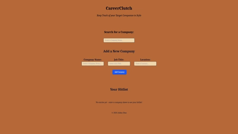

# CareerClutch

Link to Project: (LOCAL ONLY AT THIS TIME)

CareerClutch is a hitlisting application that allows users to keep track of companies that they are looking to apply to during their job hunt.

## Tech Used:

- React
- CSS + Tailwind
- JSON Server (to simulate a REST API)

## Features

- enter a company, job title, and location for each hitlist item
- filter entered companies by company name
- delete a company from their hitlist if they wish to do so

## Future Goals

- allow users to update existing companies
- allow users to enter link to job description
- prevent a user from saving a company if they do not enter all fields

## React + Vite

This template provides a minimal setup to get React working in Vite with HMR and some ESLint rules.

Currently, two official plugins are available:

- [@vitejs/plugin-react](https://github.com/vitejs/vite-plugin-react/blob/main/packages/plugin-react/README.md) uses [Babel](https://babeljs.io/) for Fast Refresh
- [@vitejs/plugin-react-swc](https://github.com/vitejs/vite-plugin-react-swc) uses [SWC](https://swc.rs/) for Fast Refresh

## Installation

1. Clone the Repository
2. cd into the project folder (if necessary)
3. npm install

## Usage

(for front-end)
1. npm run dev
2. navigate to http://localhost:5173/

(for back-end)
1. npm run server
2. navigate to http://localhost:3001/companies (optional, but can see the companies here)
